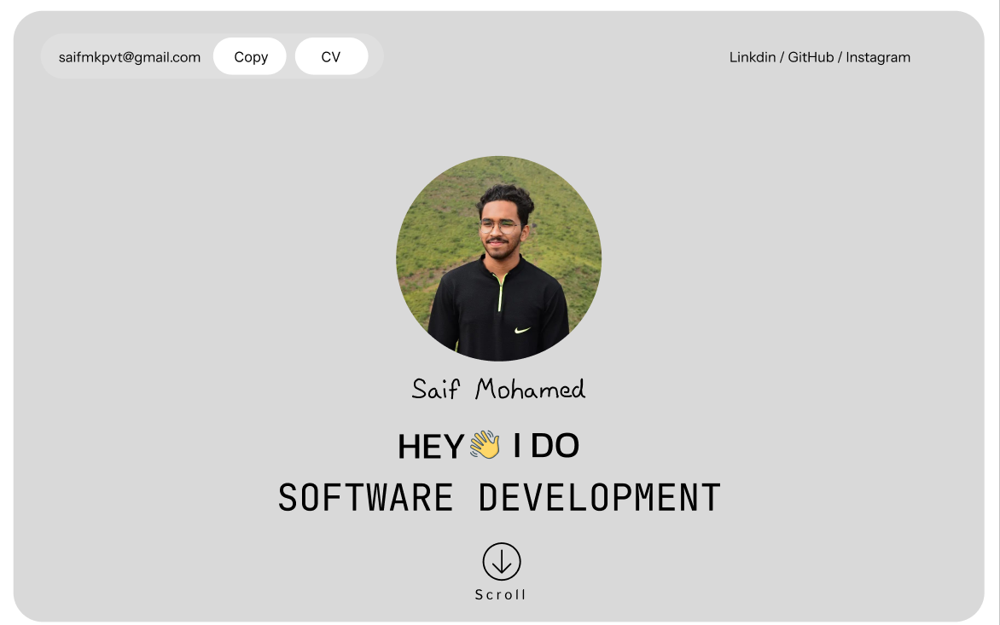

# PERSONAL PORTFOLIO
A dynamic and responsive portfolio website showcasing my skills, projects, and services as a software developer and freelancer. Built with modern web technologies and a focus on user-centric design, this site highlights my expertise in crafting innovative solutions across web development, mobile applications, and software solutions. Explore my work and connect with me for collaboration opportunities.

## Features

- Clean and responsive design for all devices
- Interactive sections
- Project highlights and description 
- Unique designing techniques

## License

[MIT](https://choosealicense.com/licenses/mit/)

## Screenshot

## Link
[VISIT NOW](https://saifmk10.github.io/saif-s-portfolio/)

